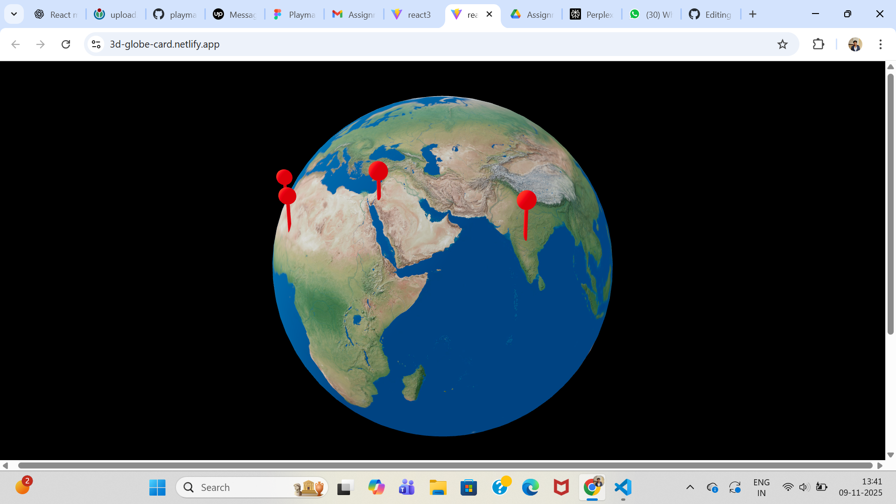
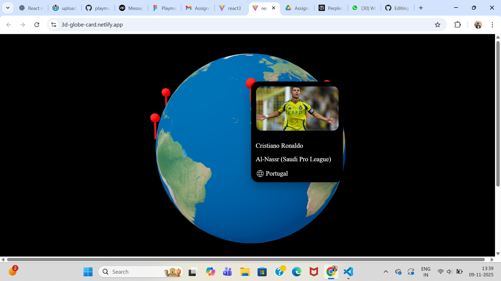

# 🌍 3D Globe with Interactive Sports Pins

This project displays a **3D Rotatable Earth** built using **React Three Fiber**, with **hoverable pins** representing famous athletes across the world.  
When you hover on a pin, a **floating card** appears showing their image, name, team, and country.

---

### 🎮 Live Demo  
👉 https://3d-globe-card.netlify.app/

---

### 🚀 Tech Stack

| Technology | Purpose |
|-----------|---------|
| React + Vite | Frontend framework and bundler |
| @react-three/fiber | 3D rendering in React |
| @react-three/drei | Useful helpers (OrbitControls, Html, etc.) |
| Three.js | WebGL 3D engine |
| CSS | UI styling |

---

### 📸 Preview

### 📸 Screenshots

<div align="center">



<br/>


<br/>


</div>


---

### Installation Guide


---

### 🔧 Setup & Run Locally

```bash
# Clone the repository
git clone https://github.com/NiloyRicky/2DMap-Globe.git

# Go inside the project
cd 2DMap-Globe

# Install dependencies
npm install

# Start development server
npm run dev


🤝 Contributing

Contributions, issues, and feature requests are welcome.
Feel free to fork this repo and submit a pull request.

🧑‍💻 Author

Made with ❤️ by YOUR NAME

